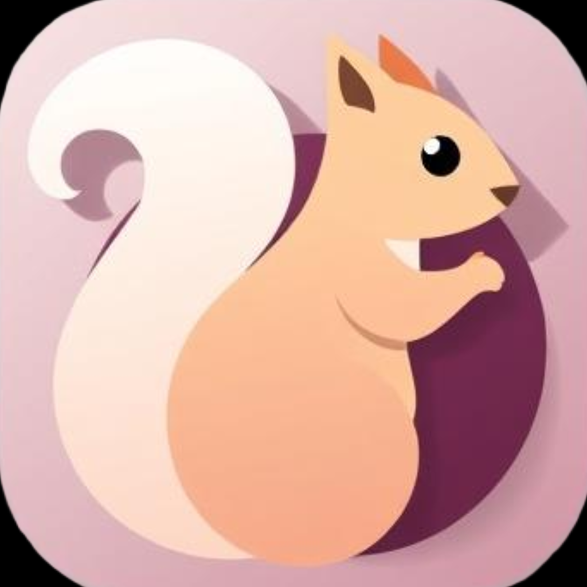

# 💫 About Me:

🔭 I’m currently working on using my knowledge in Flutter for web development 🌱 I’m currently learning React, TypeScript, JavaScript, Node.js, HTML, CSS ⏻ A machine cannot feel rage;  &nbspTherefor it shouldn’t be allowed to code;
 

##  Attention Deficit oH Dear

 

# 💻 Tech Stack:

         

<!-- Proudly created with GPRM ( https://gprm.itsvg.in ) -->

<!-- Proudly created with GPRM ( https://gprm.itsvg.in ) -->

<!--
## Hi there 👋
**Gracelium64/Gracelium64** is a ✨ _special_ ✨ repository because its `README.md` (this file) appears on your GitHub profile.

Here are some ideas to get you started:

- 🔭 I’m currently working on ...
- 🌱 I’m currently learning ...
- 👯 I’m looking to collaborate on ...
- 🤔 I’m looking for help with ...
- 💬 Ask me about ...
- 📫 How to reach me: ...
- 😄 Pronouns: ...
- ⚡ Fun fact: ...
-->
